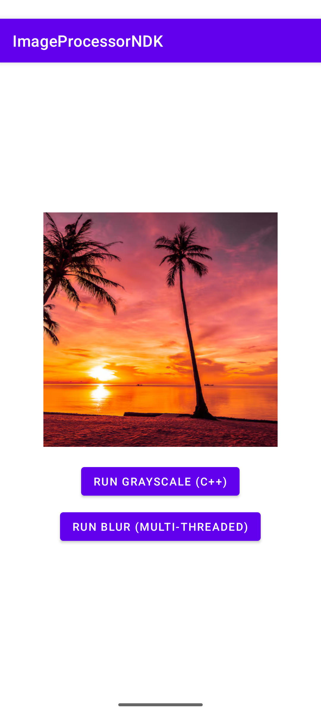
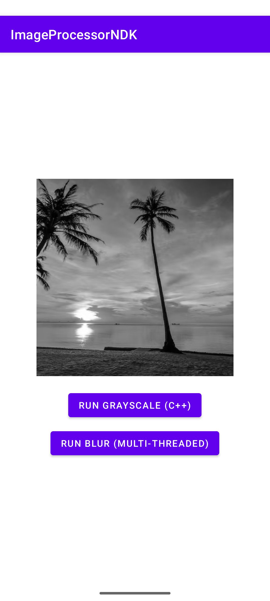

# Android Native Image Processing Benchmark (NDK)

## Overview

This project demonstrates native image processing on Android using the Android NDK (C++17) and JNI.

The application benchmarks multi-threaded grayscale and blur filters on a 1920×1080 image to analyze performance characteristics and CPU scaling behavior.

---
## Screenshots

## Screenshots

<table align="center">
  <tr>
    <td align="center">
       
      <b>Original</b>
    </td>
    <td align="center">
       
      <b>Grayscale</b>
    </td>
    <td align="center">
       
      <b>Blur</b>
    </td>
  </tr>
</table>

## Features

- Native bitmap manipulation using Android NDK
- JNI integration between Java and C++
- Multi-threaded processing using std::thread
- 3×3 convolution blur implementation
- Performance benchmarking using System.nanoTime()
- Large image workload (1920×1080)

---

## Filters Implemented

### 1️⃣ Multi-threaded Grayscale
Converts RGB pixels to grayscale using parallel processing.

### 2️⃣ Multi-threaded Blur (Optimized)
Applies a 3×3 convolution blur using:
- Work partitioning across threads
- Memory-optimized implementation (no full image copy)
  
> Note: Each filter execution resets the image to the original to ensure consistent benchmarking conditions.
---

## Performance Results (Sample)

| Filter | Execution Time |
|--------|----------------|
| Grayscale (MT) | ~15–25 ms |
| Blur (MT Optimized) | ~110–130 ms |

*Results vary depending on device hardware.*

---

## Engineering Insights

- Grayscale scales efficiently with parallelization due to simple per-pixel computation.
- Blur is memory-bound and requires multiple reads per pixel, limiting scaling efficiency.
- Removing full-frame memory copies significantly reduces overhead.
- Performance testing on large images reveals real CPU and memory bottlenecks.

---

## Technologies Used

- Android Studio
- Android NDK
- C++17
- JNI
- CMake
- Multi-threading (std::thread)

---

## How to Run

1. Clone the repository
2. Open in Android Studio
3. Ensure NDK and CMake are installed
4. Build and run on a physical Android device
5. Use Logcat to view performance results
